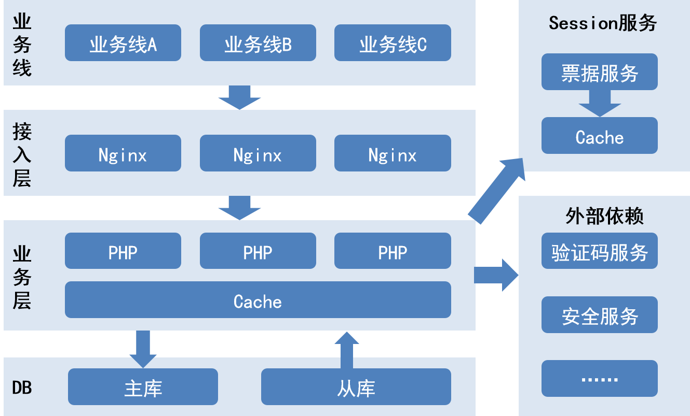
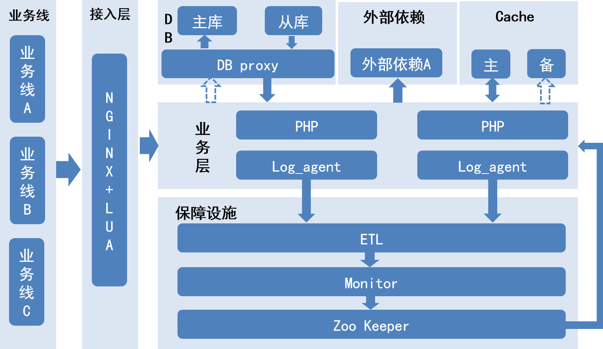

## 一次高并发项目的改进之路

### 1. 背景

以前在老东家工作的时候，曾经参与过一个高并发的项目，项目的主要任务是为一个日均请求过亿的单点登录系统进行重构，使其达到更高的稳定性及可用性，并实现自动优雅降级，流量细粒度控制等功能。过程很辛苦，万幸效果还不错，重构后的可用性能达到5个9以上。总的来说，这是一段值得纪念的日子，也是个人能力成长最为迅速的岁月。

### 2. 旧架构介绍

系统老架构可以参考下图，当时的系统是一个比较简单的分层架构，接入层使用Nginx做了负载均衡，业务逻辑层是多个平行的应用部署实例，cache采用了memcache集群，后端是Mysql集群做持久化存储。除此之外，我们背后还有一个C写的Session服务，该服务的主要功能是会话管理，包括登录票据的生成，验证和销毁等，为了性能，我们将数据全部放入cache，并没有做持久化。另外还有一些外部的验证码和安全验证服务等。

这个系统在初期还是基本上能满足业务需求的，但是随着业务量的增长和越来越复杂的业务逻辑增加，逐渐的变得难以维护，并且稳定性也难以支撑业务的进一步扩张。主要的问题点可以归纳为以下几点：

1. 整个请求过程都是同步进行的，这就意味着一次请求过程可能会耗费不少的时间在一些非必要的处理逻辑上，因为系统的最大连接数是有限的，这将导致整个系统的并发承受能力下降。
2. 对一些非核心系统和功能有强依赖强耦合，对于一些外部依赖服务，他们的SLA可能达不到我们的稳定性要求，如果我们对其有强耦合，这些依赖将成为我们整个服务的稳定性的短板。
3. 没有一个自动化的快速降级方案，对于一些突发性的系统异常（主要是依赖服务的异常），常常需要人工通过短信报警来得知并处理，而从异常发生到人工介入处理，这中间往往需要十几分钟甚至更久的时间，对于一个基础服务来说，是不可接受的。
4. cache集群稳定性不佳，由于机房的原因，我们的cache集群经常有不稳定的情况，由于我们的所有票据信息都是存放在cache中，一旦cache集群挂掉，整个服务基本上面临瘫痪，而如果数据丢失，则是所有用户登陆态的失效。

### 3. 改进思路

1. 非必要的逻辑异步化。我们梳理了整个登录流程中需要同步执行的核心逻辑，如用户名密码校验，安全校验等，除此之外的逻辑，如登录历史的保存等，走异步逻辑。异步化不仅是对性能的提升，也是对系统进行解耦的一个过程。通过异步化，我们解除了对于Mysql主库的强依赖（写操作对于登录过程并不是必须的），以前写主库操作可能是系统的瓶颈之一，现在我们可以做到在主库挂掉的情况下，几乎完全不影响用户的登录，同时具备了能够大量扩容的能力（因为DB从库可以配置大量的实例）。

2. 所有非关键路径的外部服务必须设置降级开关。降级开关可以在服务故障的时候方便我们快速的摘除故障服务，保证最基本的服务可用。实际上，最后我们可以在只有DB从库可用的情况下，还能够执行最基本的登录服务，当然，会损失一部分的用户体验。

3. 服务降级自动化。降级开关可以方便我们摘除服务，但是自动降级可以使系统止损的时间大大提前，人工介入降级始终会存在一定的滞后性，可能是几分钟，也可能是半个小时，但是作为一个基础服务是不允许有这么长时间的服务不可用的。首先，我们把降级开关配置放到了zookeeper上，并在每台机器上装上了watcher，保证配置发生变化的时候能够第一时间通知到系统；然后我们通过日志清洗和实时流计算，做了一个简单的通知方案，即当日志中的关键词达到一定频率之后，自动通知zookeeper更新配置，自动降级。该方案实施后，我们基本上能满足故障发生5s内自动降级，且无需人工介入。

4. cache的备份。我们的登录票据信息都是在cache中的，原有集群不太稳定，一旦发生异常，相当于所有用户登录态的丢失，后果不敢想象。因此我们在异地机房做了另一套cache集群，在写本地cache的时候，同时异步写异地的cache，这样在本地cache故障时，能够快速地切换至异地cache并且数据基本无丢失。

5. 除了以上4点之外，我们还做了一些其他的事情，如流量的垂直分离，灰度发布机制，防攻击策略等。我们的流量分离能够保证重要流量入口不受其他流量的影响；而灰度发布机制则是通过openresty在接入层实现的，可以达到在param或者cookie粒度的流量控制。

### 4. 总结

总的来说，系统的稳定性建设是一个非常系统化且繁琐的事情，它要求我们在对系统有足够了解的基础上，能够准确的分析出系统有可能出现的每一个异常的地方，并通过某种合理的方式去解决这些想象中的问题。最后放一张我们更新后的架构图吧。